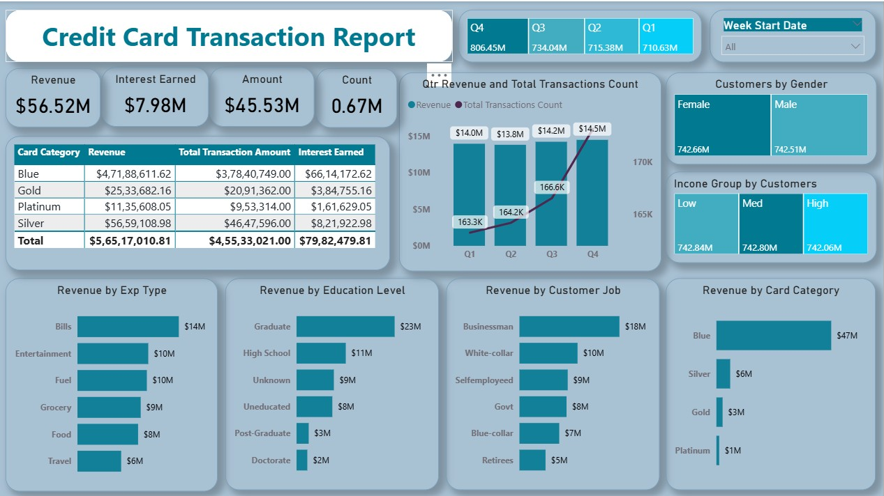
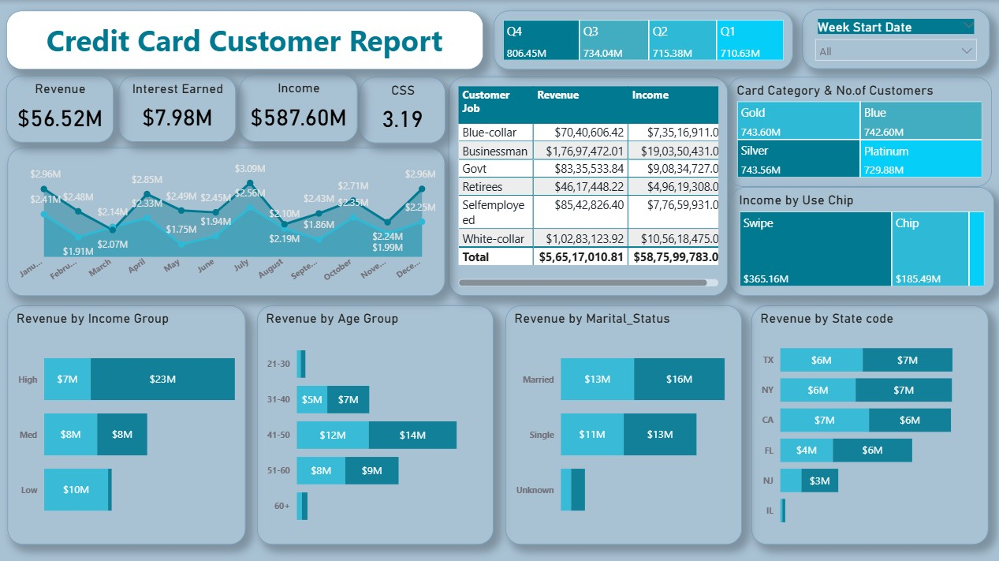

# 💳 Credit Card Customer Analysis - Power BI Dashboard

This project showcases a Power BI dashboard developed to analyze credit card customer behavior, transaction trends, and revenue insights. It helps business stakeholders understand customer segments, identify high-value users, and track product performance over time.

## 📊 Dashboard Features

- 🔍 Customer segmentation by region, age group, and card type
- 📈 Monthly and yearly revenue trends
- 🎯 Key KPIs: Total Revenue, Average Spend per Customer, Active Cardholders
- 🧠 Dynamic tooltip using report page (Page 1) for contextual insights
- ⏱ Time-based analysis using slicers (e.g., by month, year)
- ⚙️ Built with Power Query, DAX, and Power BI visuals

## 📁 Files

- `Credit Card Dashboard.pbix` – Complete Power BI dashboard file
- `dashboard.png` *(optional)* – Screenshot of the dashboard UI

## 📷 Dashboard Preview

## 🚀 How to Use

1. Download the `.pbix` file from this repository.
2. Open with **Power BI Desktop**.
3. Explore interactive charts, filters, and tooltip-based insights.

## 📌 Use Cases

- Marketing teams can identify target segments for campaigns.
- Finance teams can monitor KPIs like revenue and customer spend.
- Executives can make data-driven decisions from visual summaries.

